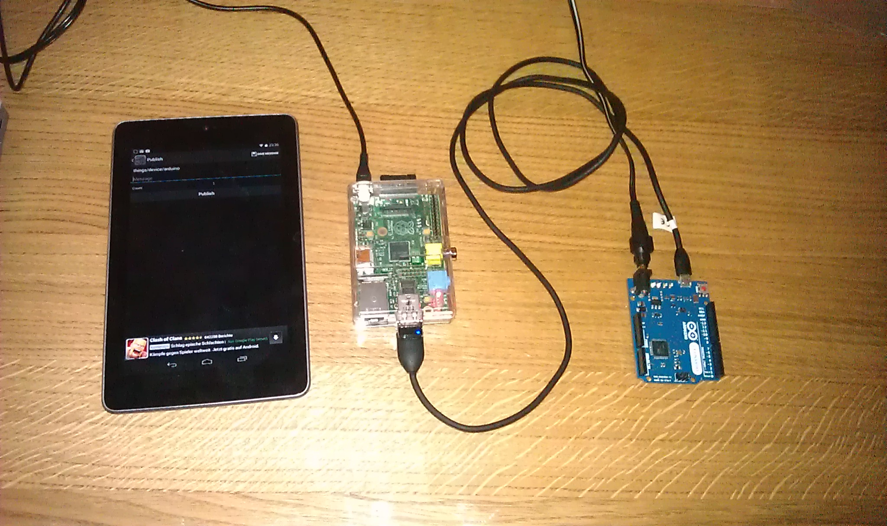

# mqtt-my-raspi

This example has been implemented during Devoxx 2013 Raspi Hackerthon and has therefore rather "Hello World" nature than 
being a best practice about how to use MQTT on a Raspi. 

MQTT-MY-RASPI consists of the following Camel routes:

* _Inbox-Route_: listens to a file directory and publishes the content of any file to a specific MQTT topic
* _Things-Route_: subscribes to a specific MQTT topic and sends the content to a connected Arduino board using the [Things-API](https://github.com/vsenger/things-api).

Furthermore, a Things-Command can be directly published to the MQTT topic using any other MQTT client as well.

The following picture shows my test-setup (Nexus 7, Raspi, Arduino Leonardo) .

For any questions or feedback contact me on Twitter via [@tomkriechb](https://twitter.com/tomkriechb).

Thanks to Yara and Vinicius Senger ([@yarasenger](https://twitter.com/yarasenger), [@vsenger](https://twitter.com/vsenger)) for their great [Raspi Hands-On-Lab](http://www.devoxx.be/dv13-geert-bevin.html?presId=3747) at Devoxx 13.

**Note:**
The combination of CDI and Camel as used within this example might be a little bit "over-engineered". But it demonstrates, that even hardware-related APIs as the Things-API can be reused in a (micro) ESB/Java EE environment very easily. 

## Prerequisites:
* MQTT-Broker installed on Raspi  (e.g. `sudo apt-get install mosquitto`)
* JDK 1.7 (or greater) with RXTX installed on Raspi (as requirement for using Things-API)
* Things-API installed on the Arduino board
* MQTT-Client on any Android device (e.g. MyMQTT)
* Things-API Java-Implementation installed within your local Maven repository (currently only available as SNAPSHOT-version - clone/fork from [Things-API](https://github.com/vsenger/things-api) Github-Repository).

## Things-Sketch

I have adopted the Devoxx sample slightly, that the speaker component is now mapped to I/O pin 13 which is directly connected to the build-in LED. 

see [things_sample.ino](src/main/arduino/things_sample/things_sample.ino)

## Build:
`mvn clean install`

extract `target/mqtt-my-raspi-VERSION.zip`  on your Rapsi

## Run:

`java -cp "./lib/*" org.things.hackathon.mqttmyraspi.ContainerBootstrap -broker tcp://localhost:1883`
`   -topic things/device/arduino -inbox /home/pi/workbench/mqttmyraspi/inbox -arduino /dev/ttyACM0` 

* -broker ... address:port of the MQTT broker
* -topic ... the topic to which the Things-Route is subscribed
* -inbox ... the directory to which command files can be copied
* -arduino ... to serial port of the Arduino board

### directly send message to component "speaker"
`mosquitto_pub -h 192.168.1.116 -t things/device/arduino -m 'speaker?1'`
`mosquitto_pub -h 192.168.1.116 -t things/device/arduino -m 'speaker?0'`

* -h ... the server, on which the MQTT broker is running
* -t ... the topic, to which the message should be published
* -m ... the message that should be published

subscribe to a topic using mosquitto (e.g. for logging purposes)

`mosquitto_sub -h 192.168.1.116 -t things/device/arduino`

### send command within a file
by copying a file into the inbox-directory containg the content `speaker?1` the command is directly published to the given MQTT topic.

## MQTT client on Android device

* Install any MQTT client on your android device using Play Store (eg. MyMQTT-Client)
* Register the IP/Port of your MQTT broker (Settings)
* publish the Things-API Command to the desired topic (Publish)

